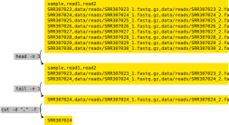

# Parallelising Jobs

:::highlight
#### Questions

- How can I parallelise jobs on a HPC?
- How can I automate job parallelisation?

#### Learning Objectives

- Distinguish between different kinds of parallel computations: multi-threading within a job and job parallelisation across independent jobs.
- Use LSF _job arrays_ to automatically submit several parallel jobs.
- Customise each parallel job of an array to use different input -> output.
:::

## Parallelising Tasks

One of the important concepts in the use of a HPC is **parallelisation**.
This concept is used in different ways, and can mean slightly different things.

A program may internally support parallel computation for some of its tasks, which we may refer to as _multi-threading_ or _multi-core processing_.
In this case, there is typically a single set of "input -> output", so all the parallel computations need to finish in order for us to obtain our result.
In other words, there is some dependency between those parallel calculations.

On the other hand, we may want to run the same program on different inputs, where each run is completely independent from the previous run. In these cases we say the task is "embarrassingly parallel".
Usually, running tasks completely in parallel is faster, since we remove the need to keep track of what each task's status is (since they are independent of each other).

Finally, we may want to do both things: run several jobs in parallel, while each of the jobs does some internal parallelisation of its computations (multi-threading).


:::note
**Terminology Alert!**

Some software packages have an option to specify how many CPU cores to use in their computations (i.e. they can parallelise their calculations).
However, in their documentation this may be referred to as **cores**, **processors**, **CPUs** or **threads**, which are used more or less interchangeably to essentially mean "how many calculations should I run in parallel?".
Although these terms are technically different, when you see this mentioned in the software's documentation, usually you want to set it as the number of CPU cores you request from the cluster.
:::


## Job Arrays

There are several ways to parallelise jobs on a HPC.
One of them is to use a built-in functionality in LSF called **job arrays**.

_Job arrays_ are a collection of jobs that run in parallel with identical parameters.
Any resources you request (e.g. `-n`, `-R`, `-M` `-W`) apply to each individual job of the "array".
This means that you only need to submit one "master" job, making it easier to manage and automate your analysis using a single script.

Job arrays are created with the *-J* option `-J arrayName[start-finish]` where *arrayName* becomes the Job Name and *start* and *finish* are integers defining the range of array numbers created by LSF.  For example, setting `-J testJob[1-3]` would result in three jobs sent: `testJob[1]`, `testJob[2]`, and `testJob[3]`.

If you'd like to specify the `-J` option within the script header with `#BSUB`, it needs to be one of the first arguments listed.  We recommend placing it as the third, below -G and -q options.

With this array list option within `-J`, LSF then creates a special shell variable `$LSB_JOBINDEX`, which contains the array number for the job being processed.
Later in this section we will see how we can use some tricks with this variable to automate our analysis.

For now let's go through this simple example, which shows what a job array looks like (you can find this script in the course folder `lsf/parallel_arrays.sh`):

```bash
# ... some lines omitted ...
#BSUB -J parallel[1-3]
#BSUB -o logs/parallel_arrays_%I.out
#BSUB -e logs/parallel_arrays_%I.err


echo "This is task number $LSB_JOBINDEX"
echo "Using $LSB_MAX_NUM_PROCESSORS CPUs"
echo "Running on:"
hostname
```

Submitting this script with `bsub lsf/parallel_arrays.sh` will launch 3 jobs.  
The "_%I_" keyword is used in our output filename (`-o`) and will be replaced by the array number, so that we end up with three files: `parallel_arrays_1.out`, `parallel_arrays_2.out` and `parallel_arrays_3.out`.  You could also include the "_%J_" keyword to add the Job ID number to the file name.  
You can then investigate the results using `head -n 4 logs/parallel_arrays*out`.  
Looking at the output in those files should make it clearer that `$LSB_JOBINDEX` stores the array number of each job, and that each of them uses 2 CPUS (`-n2` option).
The compute node that they run on may be variable (depending on which node was available to run each job).


:::note
You can define job array numbers in multiple ways, not just sequentially.

<details><summary>More</summary>
Here are some examples:

| Option | Description |
| -: | :------ |
| `-J jobName[0-31]` | index values between 0 and 31 |
| `-J jobName[1,3,5,7]` | index values of 1, 3, 5 and 7 |
| `-J [1-100]%10` | index values between 1 and 100, batching 10 elements to run at the same time. |
</details>
:::

:::exercise

Previously, we used the `pi_estimator.R` script to obtain a single estimate of the number Pi.
Since this is done using a stochastic algorithm, we may want to run it several times to get a sense of the error associated with our estimate.

1. Use nano to open the LSF submission script in `lsf/parallel_estimate_pi.sh`. Adjust the `#BSUB` options (where word "FIXME" appears), to run the job 10 times using a job array.
2. Launch the job with `bsub`, monitor its progress and examine the output. <details><summary>Hint</summary> Note that the output of `pi_estimator.R` is now being sent to individual text files to the directory `results/pi/`. </details>
3. Bonus: combine all the output files into a single file. Should you run this operation directly on the login node, or submit it as a new job to LSF?

<details><summary>Answer</summary>

**A1.**

In our script, we need to add `#BSUB -J parallelEst[1-10]` as one of our options, so that when we submit this script to `bsub`, it will run 10 iterations of it in parallel.

Also, remember to edit LSF's working directory with your username, at the top of the script in the `#bsub -cwd` option.

**A2.**

We can launch our adjusted script with `bsub lsf/parallel_estimate_pi.sh`.
When we check our jobs with `bjobs`, we will notice several jobs with JOBID in the format "ID[1]", "ID[2]", etc.
These indicate the number of the array that is currently running as part of that job submission.

In this case, we will get 10 output log files, each with the job array number at the end of the filename (we used the `%I` keyword in the `#BSUB -o` option to achieve this).

The 10 separate estimates of Pi were written to separate text files named `results/pi/replicate_1.txt`, `results/pi/replicate_2.txt`, etc.

**A3.**

To combine the results of these 10 replicate runs of our Pi estimate, we could use the Unix tool `cat`:

`cat results/pi/replicate_*.txt > results/pi/combined_estimates.txt`

If we examine this file (e.g. with `less results/pi/combined_estimates.txt`) we can see it has the results of all the runs of our simulation.

</details>

:::


### Using `$LSB_JOBINDEX` to Automate Jobs

One way to automate our jobs is to use the job array number (stored in the `$LSB_JOBINDEX` variable) with some command-line tricks.
The trick we will demonstrate here is to parse a CSV file to read input parameters for our scripts.

For example, in our `data/` folder we have the following file, which includes information about the samples we want to process: 

```console
$ cat data/drosophila_sample_info.csv
```

```
sample,read1,read2
SRR307023,data/reads/SRR307023_1.fastq.gz,data/reads/SRR307023_2.fastq.gz
SRR307024,data/reads/SRR307024_1.fastq.gz,data/reads/SRR307024_2.fastq.gz
SRR307025,data/reads/SRR307025_1.fastq.gz,data/reads/SRR307025_2.fastq.gz
SRR307026,data/reads/SRR307026_1.fastq.gz,data/reads/SRR307026_2.fastq.gz
SRR307027,data/reads/SRR307027_1.fastq.gz,data/reads/SRR307027_2.fastq.gz
SRR307028,data/reads/SRR307028_1.fastq.gz,data/reads/SRR307028_2.fastq.gz
SRR307029,data/reads/SRR307029_1.fastq.gz,data/reads/SRR307029_2.fastq.gz
SRR307030,data/reads/SRR307030_1.fastq.gz,data/reads/SRR307030_2.fastq.gz
```

This is a CSV (comma-separated values) format, with three columns named "sample", "read1" and "read2".
Let's say we wanted to obtain information for the 2nd sample, which in this case is in the 3rd line of the file (because of the column names header). 
We can get the top N lines of a file using the `head` command (we pipe the output of the previous `cat` command):

```console
$ cat data/drosophila_sample_info.csv | head -n 3
```

This gets us lines 1-3 of the file. 
To get just the information about that 2nd sample, we can now _pipe_ the output of the `head` command to the command that gets us the bottom lines of a file `tail`:

```console
$ cat data/drosophila_sample_info.csv | head -n 3 | tail -n 1
```

Finally, to separate the two values that are separated by a comma, we can use the `cut` command, which accepts a _delimiter_ (`-d` option) and a _field_ we want it to return (`-f` option):

```console
$ cat data/drosophila_sample_info.csv | head -n 3 | tail -n 1 | cut -d "," -f 1
```

In this example, we use comma as a delimiter field and obtained the first of the values after "cutting" that line. 

Schematically, this is what we've done:



So, if we wanted to use job arrays to automatically retrieve the relevant line of this file as its input, we could use `head -n $LSB_JOBINDEX` in our command pipe above. 
Let's see this in practice in our next exercise. 


:::exercise

{ width=50% }

Continuing from our previous exercise where we [prepared our _Drosophila_ genome for bowtie2](04-software.html#Example:_Sequence_Read_Alignment), we now want to map each of our samples' sequence data to the reference genome.

Looking at our data directory (`ls hpc_workshop/data/reads`), we can see several sequence files in standard _fastq_ format.
These files come in pairs (with suffix "_1" and "_2"), and we have 8 different samples.
Ideally we want to process these samples in parallel in an automated way.

We have also created a CSV file with three columns in the `data` directory.
One column contains the sample's name (which we will use for our output files) and the other two columns contain the path to the first and second pairs of the input files.
With the information on this table, we should be able to automate our data processing using a LSF job array.

1. Use _nano_ to open the LSF submission script in `lsf/parallel_drosophila_mapping.sh`. The first few lines of the code are used to fetch parameter values from the CSV file, using the special `$LSB_JOBINDEX` variable. Fix the `#BSUB -J` option to get these values from the CSV file. <details><summary>Hint</summary>The array should have as many numbers as there are lines in our CSV file. However, make sure the array number starts at 2 because the CSV file has a header with column names.</details>
2. Launch the job with `bsub` and monitor its progress (`bjobs`), whether it runs successfully (`bacct`), and examine the LSF output log files.
3. Examine the output files in the `results/drosophila/mapping` folder. (Note: the output files are text-based, so you can examine them by using the command line program `less`, for example.)

<details><summary>Answer</summary>

**A1.**

Our array numbers should be: `#BSUB -J drosophila[2-9]`.
We start at 2, because the parameter values start at the second line of the parameter file.
We finish at 9, because that's the number of lines in the CSV file.

We also need to adjust the `head -n` command a few lines down to pull the correct line according to the `$LSB_JOBINDEX` variable assigned to each job.

**A2.**

We can submit the script with `bsub lsf/parallel_drosophila_mapping.sh `.
While the job is running we can monitor its status with `bjobs`.
We should see several jobs listed with IDs as `JOBID[ARRAYID]` format.

Because we used the `%I` keyword in our `#BSUB -o` option, we will have an output log file for each job of the array.
We can list these log files with `ls logs/drosophila_mapping_*.out` (using the "*" wildcard to match any character).
If we examine the content of one of these files (e.g. `cat logs/drosophila_mapping_2.out`), at the top we should only see the messages we printed with the `echo` commands.
The actual output of the `bowtie2` program is a file in [SAM format](https://en.wikipedia.org/wiki/SAM_file_format), which is saved into the `results/drosophila/mapping` folder.

**A3.**

Once all the array jobs finish, we should have 8 SAM files in `ls results/drosophila/mapping`.
We can examine the content of these files, although they are not terribly useful by themselves.
In a typical bioinformatics workflow these files would be used for further analysis, for example SNP-calling.

</details>

:::


## Summary

:::highlight
#### Key Points

- Some tools internally parallelise some of their computations, which is usually referred to as _multi-threading_ or _multi-core processing_.
- When computational tasks are independent of each other, we can use job parallelisation to make them more efficient.
- We can automatically generate parallel jobs using LSF job arrays with the `bjobs` option `-J`.
- LSF creates a variable called `$LSB_JOBINDEX`, which can be used to customise each individual job of the array.
  - For example we can obtain the input/output information from a simple configuration text file using some command line tools:
  `cat config.csv | head -n $LSB_JOBINDEX | tail -n 1`

#### Further resources

- [LSF Job Array Documentation](https://www.ibm.com/docs/en/spectrum-lsf/10.1.0?topic=administration-job-arrays)
- [Additional Array Documentation](https://www.hpc.dtu.dk/?page_id=1434)
:::
