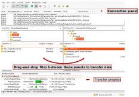

# File Transfer

:::{.callout-tip}
#### Learning Objectives

- Move files in and out of the HPC storage using _Filezilla_ or `rsync`/`scp`. 
:::


## Moving Files

There are several options to move data between your local computer and a remote server.
We will cover three possibilities in this section, which vary in their ease of use.

A quick summary of these tools is given in the table below.

| | Filezilla | SCP | Rsync |
| :-: | :-: | :-: | :-: |
| Interface | GUI | Command Line | Command Line |
| Data synchronisation | yes | no | yes |


### Filezilla (GUI)

This program has a graphical interface, for those that prefer it and its use is relatively intuitive.

To connect to the remote server (see Figure 3):

1. Fill in the following information on the top panel:
  - Host: gen22
  - Username: your HPC username
  - Password: your HPC password
  - Port: 22
1. Click "Quickconnect" and the files on your "home" should appear in a panel on right side.
1. Navigate to your desired location by either clicking on the folder browser or typing the directory path in the box "Remote site:".
1. You can then drag-and-drop files between the left side panel (your local filesystem) and the right side panel (the HPC filesystem), or vice-versa.




### `scp` (command line)

This is a command line tool that can be used to copy files between two servers.
One thing to note is that it always transfers all the files in a folder, regardless of whether they have changed or not.

The syntax is as follows:

```bash
# copy files from the local computer to the HPC
scp -r path/to/source_folder <user>@gen22:path/to/target_folder

# copy files from the HPC to a local directory
scp -r <user>@gen22:path/to/source_folder path/to/target_folder
```

The option `-r` ensures that all sub-directories are copied (instead of just files, which is the default).


### `rsync` (command line)

This program is more advanced than `scp` and has options to synchronise files between two directories in multiple ways.
The cost of its flexibility is that it can be a little harder to use.

The most common usage is:

```bash
# copy files from the local computer to the HPC
rsync -auvh --progress path/to/source_folder <user>@gen22:path/to/target_folder

# copy files from the HPC to a local directory
rsync -auvh --progress <user>@gen22:path/to/source_folder path/to/target_folder
```

- the options `-au` ensure that only files that have changed _and_ are newer on the source folder are transferred
- the options `-vh` give detailed information about the transfer and human-readable file sizes
- the option `--progress` shows the progress of each file being transferred

:::{.callout-warning}

When you specify the *source* directory as `path/to/source_folder/` (with `/` at the end) or `path/to/source_folder` (without `/` at the end), `rsync` will do different things:

- `path/to/source_folder/` will copy the files *within* `source_folder` but not the folder itself
- `path/to/source_folder` will copy the actual `source_folder` as well as all the files within it
:::

::: {.callout-tip}
To check what files `rsync` would transfer but not actually transfer them, add the `--dry-run` option. This is useful to check that you've specified the right source and target directories and options.
:::


### Exercise

::: {.callout-exercise}
#### Copying files to the cluster

- <a href="https://www.dropbox.com/scl/fo/9x1ue3qjetisn2m4011dn/AI3c7fHrcow2u2pi9l09HME?rlkey=izz21i46uhhx8tl4u18k2e6gm&st=hpvmc858&dl=1" target="_blank" rel="noopener noreferrer">Download the data</a> for this course to your computer and place it on your Desktop. (do not unzip the file yet!)
- Use _Filezilla_, `scp` or `rsync` (your choice) to move this file to the directory we created earlier: `~/hpc_workshop/`.
- The file we just downloaded is a compressed file. From the HPC terminal, use `unzip` to decompress the file.
  - Note: macOS often unzips downloaded files by default. If that is the case you can skip this step.
- Confirm that all the files are present in your folder, the command `ls ~/hpc_workshop` should return:

    ```
    analysis_scripts  data  job_logs  job_scripts
    ```

::: {.callout-answer}

Once we download the data to our computer, we can transfer it using either of the suggested programs.
We show the solution using command-line tools.

Notice that these commands are **run from your local terminal**:

```bash
# with scp
scp -r ~/Desktop/hpc_workshop_files.zip username@gen22:hpc_workshop/

# with rsync
rsync -avhu ~/Desktop/hpc_workshop_files.zip username@gen22:hpc_workshop/
```

In our case, the Zip file was downloaded to our Desktop, but you can adjust this depending on where the file was downloaded in your case. 
For example, another common default is a folder named "Downloads".

Once we finish transfering the files, we can go ahead and decompress the data folder.
Note, this is now run **from the HPC terminal**:

```bash
# make sure to be in the correct directory
cd ~/hpc_workshop/

# decompress the files
unzip hpc_workshop_files.zip
```

:::
:::


## Summary

::: {.callout-tip}
#### Key Points

- To transfer files to/from the HPC we can use _Filezilla_, which offers a user-friendly interface to synchronise files between your local computer and a remote server.
- Transfering files can also be done from the command line, using tools such as `scp` and `rsync` (this is the most flexible tool but also more advanced). 
:::


